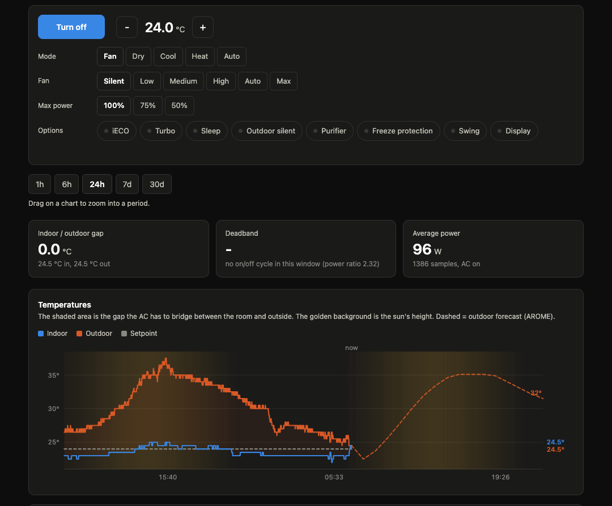
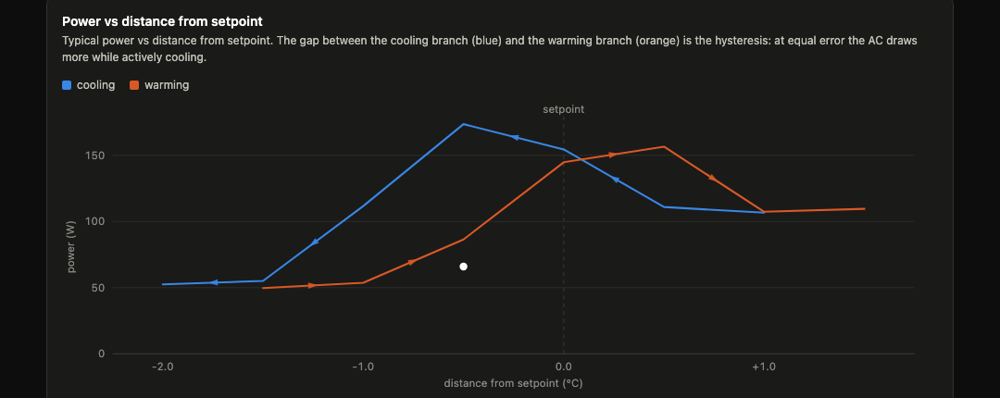
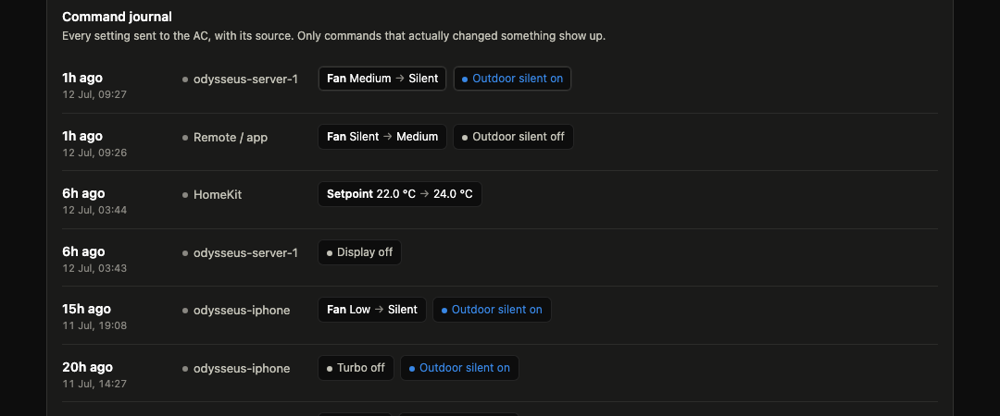

# Αἴολος

Local control for a Midea air conditioner. No cloud, no vendor app. HTTP API, web
dashboard, continuous logging, and a native Apple HomeKit bridge. Once the device is
discovered, it never talks to the internet again.

Built on [msmart-ng](https://github.com/mill1000/midea-msmart) and
[HAP-python](https://github.com/ikalchev/HAP-python). Runs on any always-on box on
your LAN (Raspberry Pi, Mac mini, NUC), reachable from anywhere over
[Tailscale](https://tailscale.com/).

Named after Aeolus (Αἴολος), keeper of the winds in the Odyssey.



## Story

This started during a French heatwave. I had just bought a Midea split AC, and the
only way to turn it on remotely was the vendor app, which needs the cloud and only
works when your phone is on the home WiFi. What I actually wanted was simple: turn
the AC on from my phone on the way home, so the flat is already cool when I walk in.

So I went local instead. The AC speaks a proprietary protocol on the LAN, and
[msmart-ng](https://github.com/mill1000/midea-msmart) implements it. From there it
grew: a small HTTP API, then logging (how much does it actually cost? how does it
behave?), then a dashboard, then HomeKit so the rest of the household could use it
too. Everything runs on a box on the home LAN and is reachable from anywhere over
Tailscale, no cloud involved.

## Features

- Full control: power, mode, target temperature, fan, swing, and the extras (iECO,
  turbo, sleep, outdoor-silent, purifier, freeze protection).
- Continuous SQLite logging every 60s: indoor/outdoor temp, target, power draw, mode.
- Web dashboard at `/chart`: temperature and power charts, drag to zoom, a readable
  power-vs-setpoint curve, and a command journal that records who changed what and
  when, including changes made from the physical remote or the Midea app.
- HomeKit: shows up in the Home app, works with Siri, shareable with the household.
- Resilient: survives the AC being unplugged, the router rebooting, or the IP
  changing (auto re-discovery). Never records phantom samples.
- The temperature chart shades the background by the sun's height (computed, no
  API) and can extend the outdoor curve with a weather forecast (Open-Meteo, AROME
  by default), so you can see the heat coming.

The hysteresis view aggregates power by distance from setpoint, so it stays readable
over any span. On an inverter that modulates, the cooling and warming branches
separate by how hard it is working:



The command journal shows every change with its source, including ones made from the
physical remote or the Midea app (detected by watching the state, not our API):



## Requirements

- A Midea AC (or an msmart-compatible rebrand: Comfee, Inventor, Pioneer, some
  Toshiba/Carrier units) already on your WiFi via the vendor app.
- An always-on machine on the same LAN. Python 3.11+.
- Optional: Tailscale on that machine for remote access without exposing anything.

## Install

```sh
git clone https://github.com/<you>/clim-midea.git
cd clim-midea
python3 -m venv .venv
source .venv/bin/activate
pip install "msmart-ng" fastapi "uvicorn[standard]" python-dotenv "HAP-python[QRCode]" pypng
```

## Get your AC credentials

This is the one step that uses the Midea cloud, once. It gives you the IP, device id,
and (on "V3" devices) a token/key pair that encrypts the local session.

```sh
.venv/bin/msmart-ng discover
```

Output looks like:

```
{'ip': '192.168.1.42', 'id': 123456789012345, 'supported': True,
 'name': 'net_ac_XXXX', 'key': 'YOUR_KEY', 'token': 'YOUR_TOKEN'}
```

Keep the token and key somewhere safe. They are what makes the setup independent:
regenerating them needs the Midea cloud to answer. If discover finds nothing, check
that the machine and the AC are on the same WiFi subnet (not a guest network). Some
devices need `--account` / `--password` (your Midea app login), see
`msmart-ng discover --help`.

## Configure

```sh
cp .env.example .env
# then fill AC_IP, AC_ID, AC_TOKEN, AC_KEY from the discover output
```

## Run

```sh
.venv/bin/uvicorn ac_server:app --host 127.0.0.1 --port 8787
```

Open http://127.0.0.1:8787/chart, or `curl http://127.0.0.1:8787/status`.

To keep it running: macOS, edit `clim.plist.example` (paths, bind host) and load it
with launchd. Linux, a systemd unit does the same job.

For remote access, bind to your Tailscale IP instead of `0.0.0.0`. The service then
answers on your tailnet only, never the LAN or internet. There is no app-level auth,
so the tailnet is the security boundary. Do not bind to `0.0.0.0`.

## API

```
GET  /status            current state, read back from the AC
GET  /capabilities      what this unit supports
GET  /health            diagnostics, never touches the AC
GET  /chart             web dashboard
GET  /say               state as plain text (for Siri / Shortcuts)
GET  /history?hours=24  samples (or ?start=<epoch>&end=<epoch>)
GET  /hysteresis?hours=24
GET  /commands?limit=50 command journal
GET  /pair              HomeKit pairing page (QR + code)

POST /set    {"power":true,"mode":"COOL","target":23,"fan":"SILENT"}
POST /on?temp=23&mode=COOL&fan=SILENT
POST /off
POST /toggle?temp=23&mode=COOL
POST /temp?value=22.5
POST /mode?value=HEAT
POST /fan?value=AUTO
POST /display
```

`/set` validates against the device's real capabilities and returns the state read
back after applying. Every command silences the beep.

## HomeKit

The bridge serves its own pairing page at `/pair`: open it in any browser and it
shows a **generated QR code** plus the pairing code, so you don't have to hunt for
either. Then in the Home app: Add Accessory, scan the QR (or "More options" and pick
the accessory), enter the code.

Change `AC_HOMEKIT_PIN` before deploying. The phone must be on the same WiFi to pair.
Remote HomeKit access needs an Apple home hub (HomePod or Apple TV).

Pairing a DIY HomeKit accessory can be finicky. If it does not show up or says it is
"already in another home", the fixes that worked here: make sure the phone is on the
same LAN with any VPN off, and if a previous attempt got stuck, remove the phantom
accessory (or delete the home) to clear Apple's iCloud cache. The accessory uses a
unique serial per identity to avoid that trap.

## Notes

- The AC accepts only one LAN session at a time. Logger, API and HomeKit share one,
  behind a lock.
- `msmart.refresh()` does not raise on a network error, it keeps default values. The
  logger checks `device.online` so it never records phantom samples.
- Some settings are device-specific: `eco` may really be `ieco`, and iSense/Follow-Me
  can only be set from the remote. The code validates and refuses rather than lie.

## License

[MIT](LICENSE).
